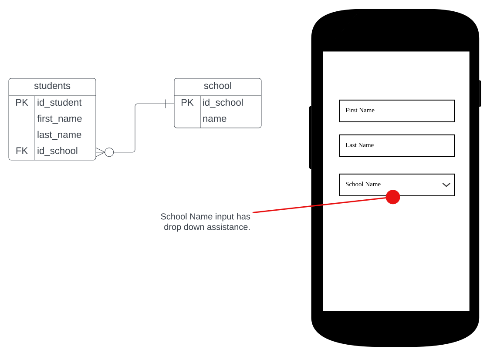

# README
 
#### Figure 1: Students ERD.

### Steps in building a rails app.
* routes

|verb| action           |
| :---: |:-----------------|
|GET| students#index   |
|GET| students#show    |
|GET| students#new     |
|POST| students#create  |
|GET| students#edit    |
|PUT| students#update  |
|PATCH| students#update |
|DELETE| students#destroy |

* controller
* view
* model

# rails_model
# rails_model
